> オリジナルプロジェクト: [https://github.com/svcvit/Awesome-Dify-Workflow](https://github.com/svcvit/Awesome-Dify-Workflow)

便利なDifyワークフローを共有します。学習と実用の両方に役立ちます。Dify 0.13.0以降のバージョンでインポートしてください。**マルチタスク並列処理**、**セッション変数**、**フォーム**、**echartレンダリング**などの機能をサポートしています。Agentノードは1.0バージョン以降の機能なので、可能な限り最新版のDIFYを使用してインポートしてください。

すべてのWorkflowは基本的に**無料**で使用できます。より多くのWorkflowを収集・整理中です。

## シェアグループ
シェアグループを作成しました。興味のある方は参加してください。workflowに関する質問があれば、一緒に議論できます。（2025/04/07更新）
- メイングループは200人を超えました。グループ管理者に友達申請を送り、「dify」とメモを付けて、人数の多いグループに招待してもらってください。ただし、WeChatのセキュリティ制御により、時々友達申請ができない場合があります。その場合は、後で再度試してください。
- もちろん、新しいグループに参加することもできます。現在は人数が少なく、基本的に3-7日で200人に達します。
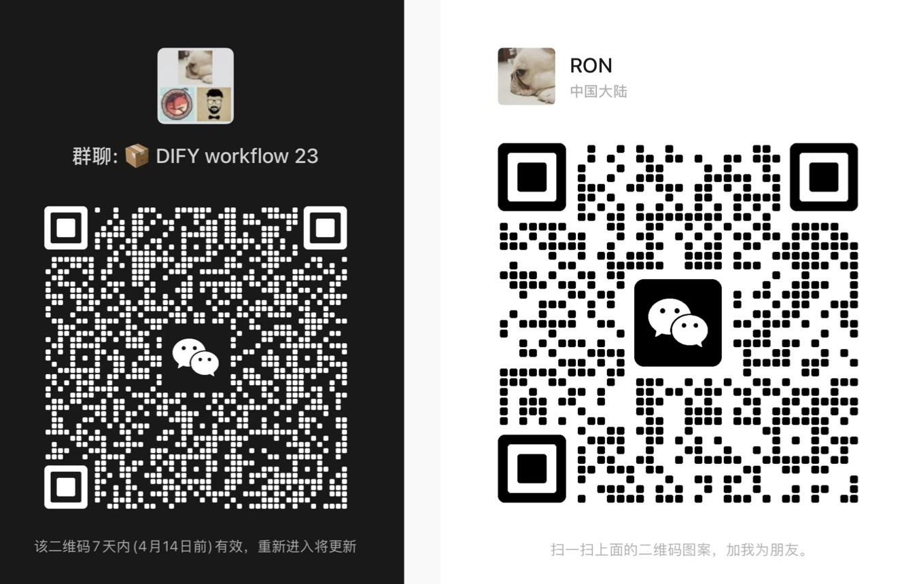

## よくある質問
ここではグループでよくある質問をまとめています。不定期に更新され、内容は多くありませんが、参考になれば幸いです。

[AIプロセスプラットフォーム比較——Dify、Fastgpt、Ragflow](https://zerozzz.win/ai-%E6%B5%81%E7%A8%8B%E5%B9%B3%E5%8F%B0%E5%AF%B9%E6%AF%94dify%E3%80%81fastgpt%E3%80%81ragflow)

difyの国内ミラーソースの設定方法は？

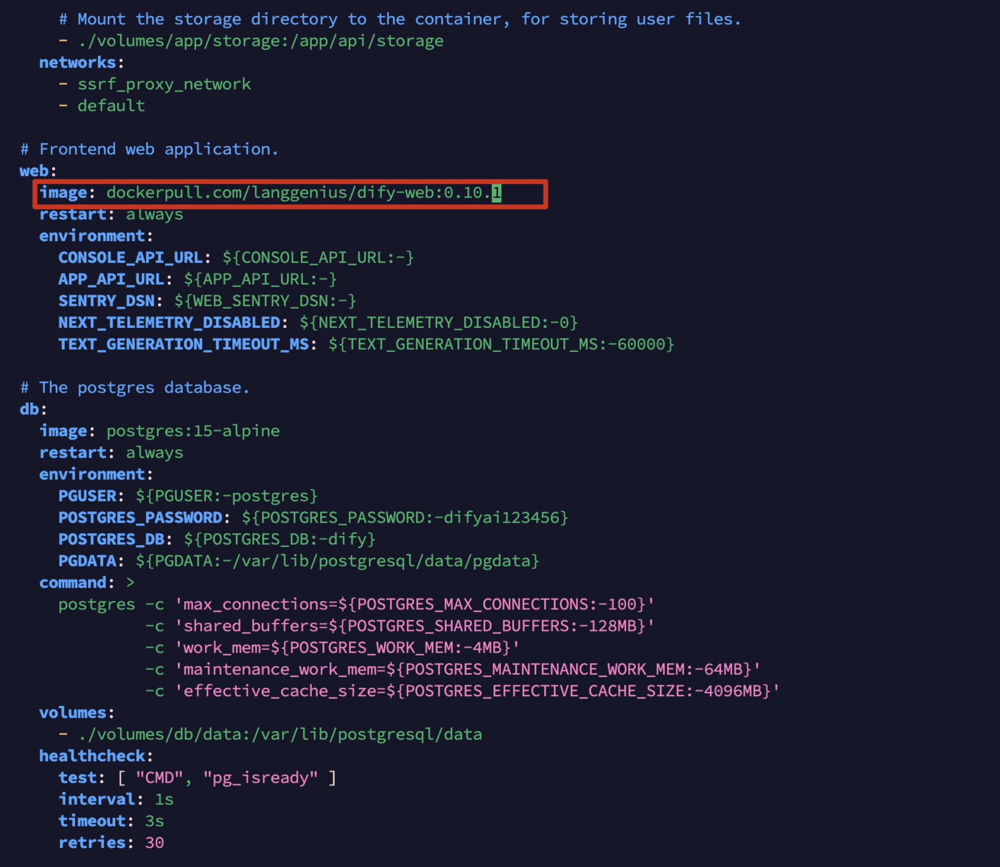

A：通常、すべてのimageのリンクの前にdockerpull.orgを追加します。

sandboxでpandasなどのサードパーティライブラリをインストールするには？

A：/docker/volumes/sandbox/dependencies/python-requirements.txtを開き、必要な依存関係を記入し、sandboxを再起動します。

定期的なタスクはどのように処理できますか？特定のワークフローを定期的に実行したいです。

A：プロジェクト https://github.com/leochen-g/dify-schedule を参考にしてください。

ノード間でstringデータを渡す際、制限を超えたというエラーが表示されます。どうすればよいですか？

A：.envファイルの以下の部分を修正します：
CODE_MAX_STRING_LENGTH: 1000000
TEMPLATE_TRANSFORM_MAX_LENGTH: 1000000
コンテナを再起動します。

画像URLを取得した後、チャットウィンドウに表示できますか？markdownを試しましたが何も表示されません。

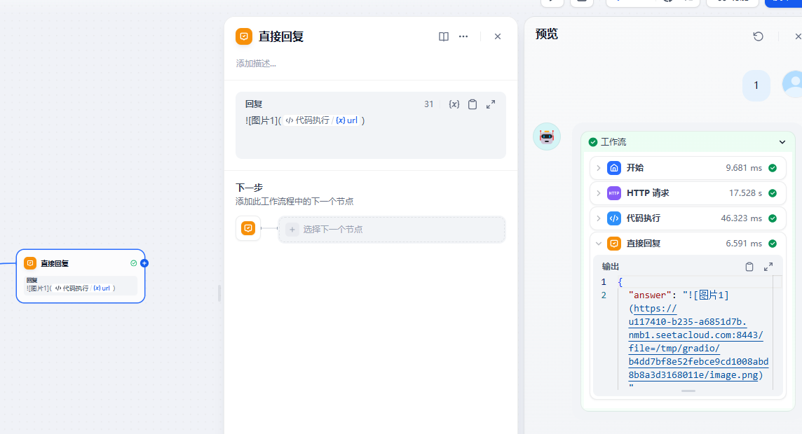

A：あなたの方法は正しいですが、画像がクロスドメインをサポートしていないため、レンダリングされません。

知識ベースに大きなファイルをアップロードするとエラーが発生します。設定ファイルを修正しても、大きなファイルをアップロードできません。

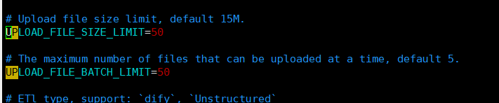

A：nginxも修正する必要があります。.envファイル内でnginxを検索すると見つかります。

知識ベースが永久にキューに入る問題

A：.envファイルの以下の部分を修正します：LOG_FILE=/app/logs/server.log；コンテナを再起動します。

Difyを独学するにはどこで学べますか？

A：https://dify101.com を参考にしてください。

Difyでグラフを生成する良い方法はありますか？

A：Difyには棒グラフ、曲線グラフなどの描画機能が組み込まれています。また、Echartsプラグインを自分で作成し、データベースからデータを読み取ってグラフを描画することもできます。

Dify知識ベースにPDFをアップロードすると文字化けします。どうすればよいですか？

A：PDFをMarkdown形式に変換するツールを使用してからアップロードしてください。

DuckDuckGo翻訳は現在使用できませんか？

A：サーバーにプロキシが設定されていますが、difyはdocker内で起動しているため、プロキシが設定されていません。

Difyの公式サンプルアプリケーションはすべて英語です。日本語に切り替えるにはどうすればよいですか？

A：右上のアバターをクリックし、設定、言語の順に選択し、まず他の言語に切り替えてから日本語に切り替えます。

管理者パスワードを忘れた場合はどうすればよいですか？

A：以下のコマンドを実行します：docker exec -it docker-api-1 flask reset-password

## SANDBOX
sandboxでpandas、numpy>2.0、matplotlib、scikit-learnのコードを実行すると頻繁にエラーが発生します。私が開発した別のシンプル版[dify-sandbox-py](https://github.com/svcvit/dify-sandbox-py)を使用すると、これらの依存関係が正常に動作することが確認されています。

## DIFY 1.0 プラグイン
[dify_plugin_collection](https://github.com/svcvit/dify_plugin_collection) リポジトリにはDIFYの[公式マーケットプレイス](https://marketplace.dify.ai/)のプラグインインストールパッケージが保存されており、オフラインユーザーが自由に選択できるようになっています。不定期に更新されます。

プラグインを開発したい場合は、私が作成した2つのプラグインのソースコード [Google翻訳](https://github.com/svcvit/dify-plugin-google_translate)、[対話Agent](https://github.com/svcvit/dify-plugin-tod_agent) を参考にしてください。

## モデル

- 最近話題のdeepseek-R1を使用できます。Silicon Flowが2000万トークンを無料で提供しています。招待登録を使用すると、あなたと私の両方が2000万トークンの無料クォータを獲得できます：[https://cloud.siliconflow.cn/i/MwADckCi](https://cloud.siliconflow.cn/i/MwADckCi)
- OpenAIやAnthropicのモデルを体験したい場合は、私が構築したサービス [CoffBox](https://one.coffbox.com/) を使用できます。
設定方法は [DifyでCoffBoxのサービスを使用する方法](https://blog.vcvit.me/2024/11/13/how-to-use-one-api-in-dify/) を参考にしてください。
この方法は個人使用のみを目的としています。大規模に使用する場合は、[openrouter](https://openrouter.ai/)がより良い選択肢となります。

## 参考スクリーンショット

すべてのDSLはワークフローモードで、ツールとして公開した後、ChatBotワークフローに簡単に組み込むことができます。ワークフローには基本的な入力、条件分岐、変数アグリゲーター、出力などが含まれます。

# DSL ディレクトリ

以下の各ymlの説明を参考にして、必要なWorkflowを見つけ、DSLフォルダ内の対応するファイルのURLをコピーし、自分のDifyアカウントにインポートしてください。

## 2025-04-07更新
| ファイル | 説明 | ソース |
|---------|------|--------|
| `図文知識ベース` | 知識ベースを検索した後、図と文の効果を得たい場合は、知識ベースに画像のリモートリンクを追加する必要があります。このサンプルを参考にしてください。マークダウンファイルが含まれています。 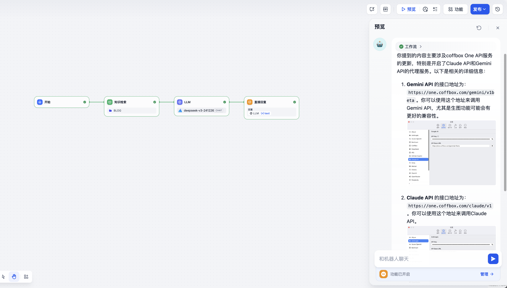 | [@svcvit](https://vcvit.me/) |

## 2025-03-26更新
| ファイル | 説明 | ソース |
|---------|------|--------|
| `MCP.yml` | [MCP Agent 戦略](https://marketplace.dify.ai/plugins/hjlarry/agent)を使用してMCPツールを呼び出すサンプル。MCPは[https://mcp.so/](https://mcp.so/server/amap-maps/amap) が提供するオンラインサービスを使用します。 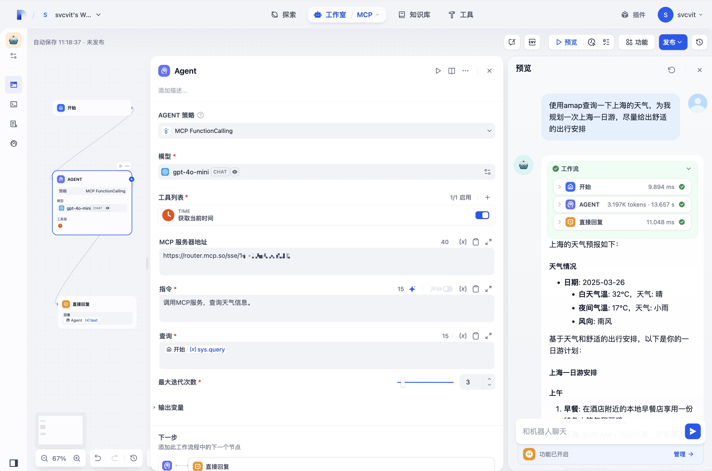 公式サンプルもあります：[Dify MCP プラグインガイド：Zapierにワンクリックで接続し、7000以上のAppツールを簡単に呼び出し](https://mp.weixin.qq.com/s/CDhqmLO1JXSB__aUMqoGoQ) | [@svcvit](https://vcvit.me/) |

## 2025-03-21更新
| ファイル | 説明 | ソース |
|---------|------|--------|
| `Demo-tod_agent.yml` | dify 1.0のAgentノードを使用し、対話シナリオに最適化されたAgent戦略を使用します。例：マルチターン対話、コンテキスト理解、情報収集など。https://marketplace.dify.ai/plugins/svcvit/agent 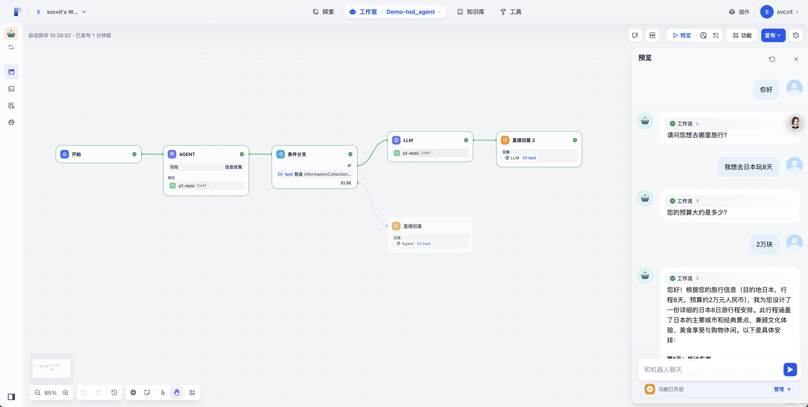 | [@svcvit](https://vcvit.me/) |

## 2025-02-24更新
| ファイル | 説明 | ソース |
|---------|------|--------|
| `Deep Researcher On Dify .yml` | Deep Researcherワークフローの再現方法 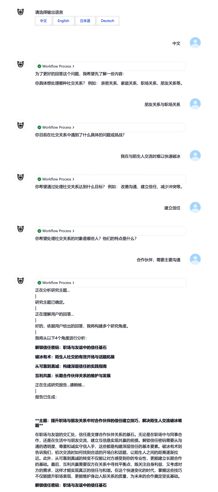 | [@AdamPlatin123](https://github.com/AdamPlatin123/Open-Deep-Research-workflow-on-Dify) |

## 2025-02-17更新
| ファイル | 説明 | ソース |
|---------|------|--------|
| `Agentツール呼び出し.yml` | dify 1.0のAgentノードを使用し、FCを使用して異なるツールを呼び出し、応答します。 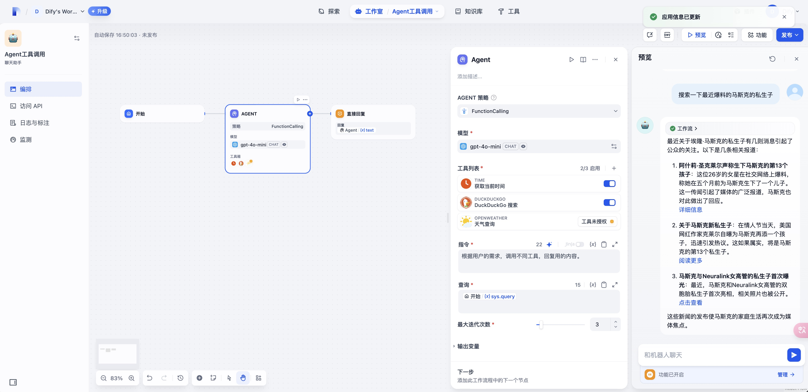 | [@svcvit](https://vcvit.me/) |

## 2025-01-23更新
| ファイル | 説明 | ソース |
|---------|------|--------|
| `旅行Demo.yml` | dify 1.0のAgentノードを使用し、旅行情報収集、Tool呼び出し、対話履歴コンテキスト保存をデモンストレーションします。対話メッセージを対話変数に保存し、Agentの思考コンテキストに組み込みます。 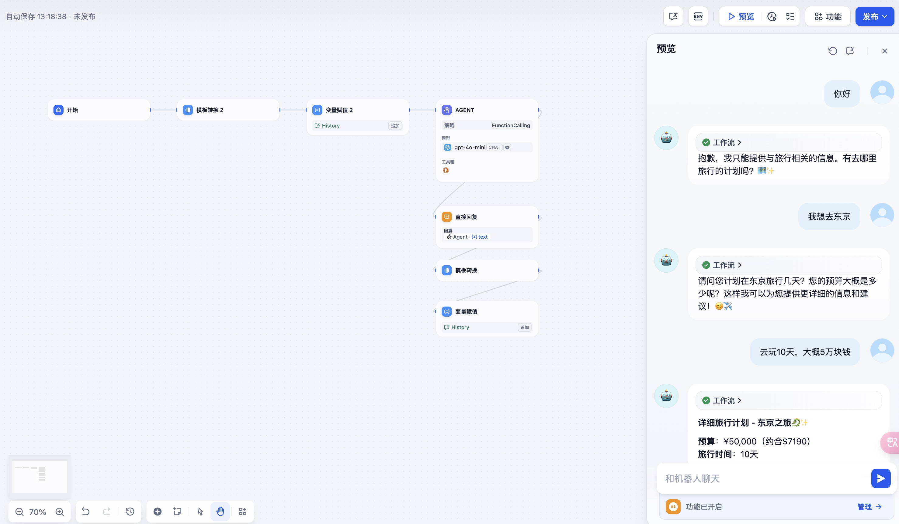 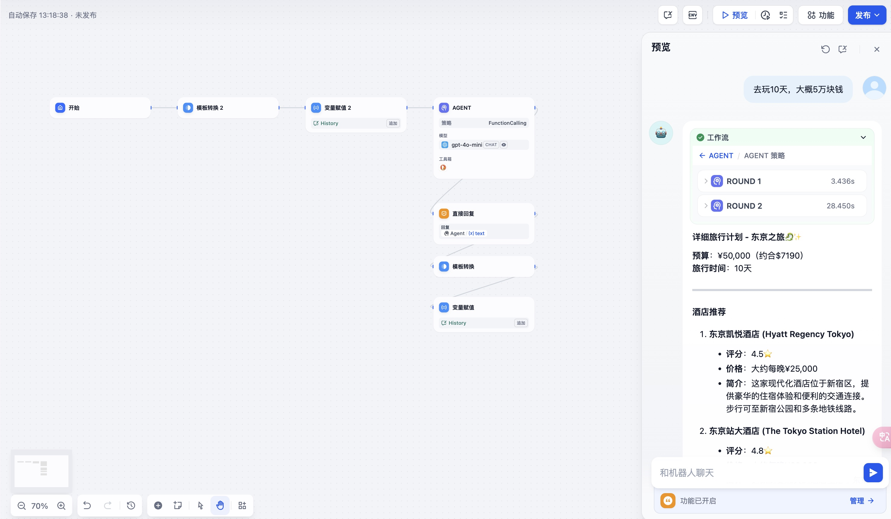 | [@svcvit](https://vcvit.me/) |

## 2025-01-21更新
| ファイル | 説明 | ソース |
|---------|------|--------|
| `春聯生成器.yml` | 春聯生成ツール。フォントはコンピュータにインストールされている必要があります。必要に応じてフォントを変更できます。 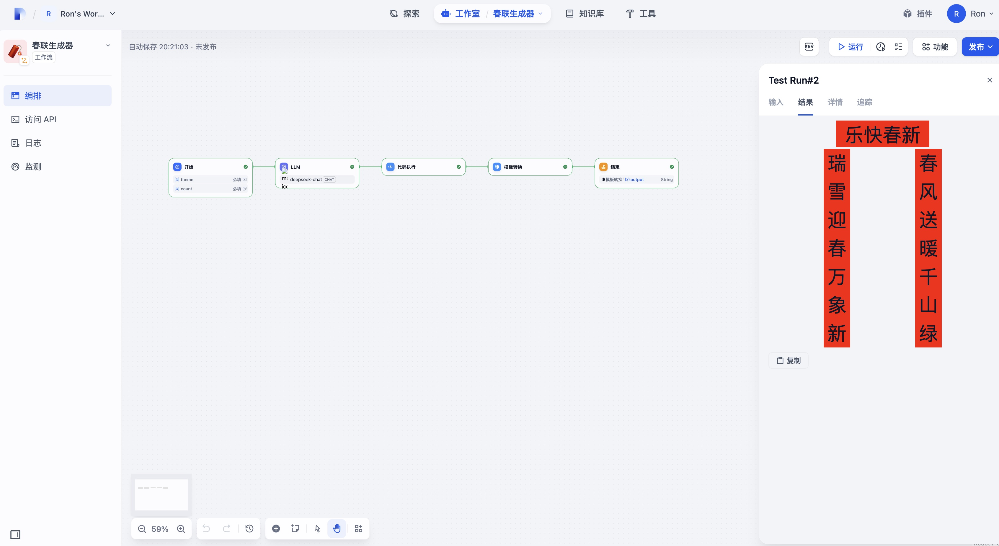 | WeChatグループ@Junjie.M |
| `春聯生成器（「福」が逆さまバージョン）.yml` | 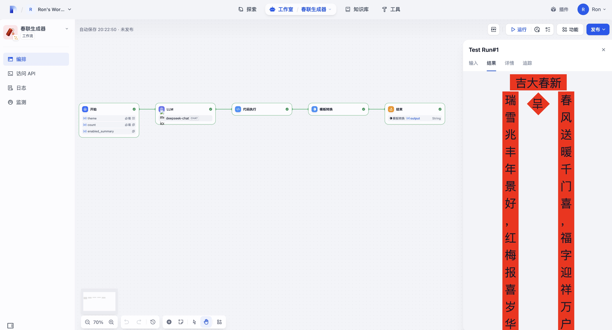 | WeChatグループ@Junjie.M |
| `やばい！LLMに囲まれた！.yml` | 【やばい！LLMに囲まれた！】を参考にしました：https://github.com/modelscope/modelscope/tree/master/examples/apps/llm_riddles 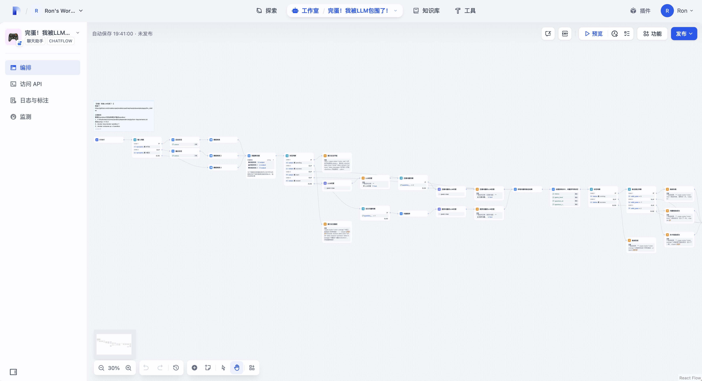 | WeChatグループ@Junjie.M |

## 2024-12-05更新
| ファイル | 説明 | ソース |
|---------|------|--------|
| `File_read.yml` | sandboxを使用してファイルを読み取り、解析します。[dify-sandbox-py](https://github.com/svcvit/dify-sandbox-py)を使用し、アップロードディレクトリをマウントする必要があります。これはpandasでcsvを読み取るサンプルです。具体的な方法は右側のソースリンクを参照してください。 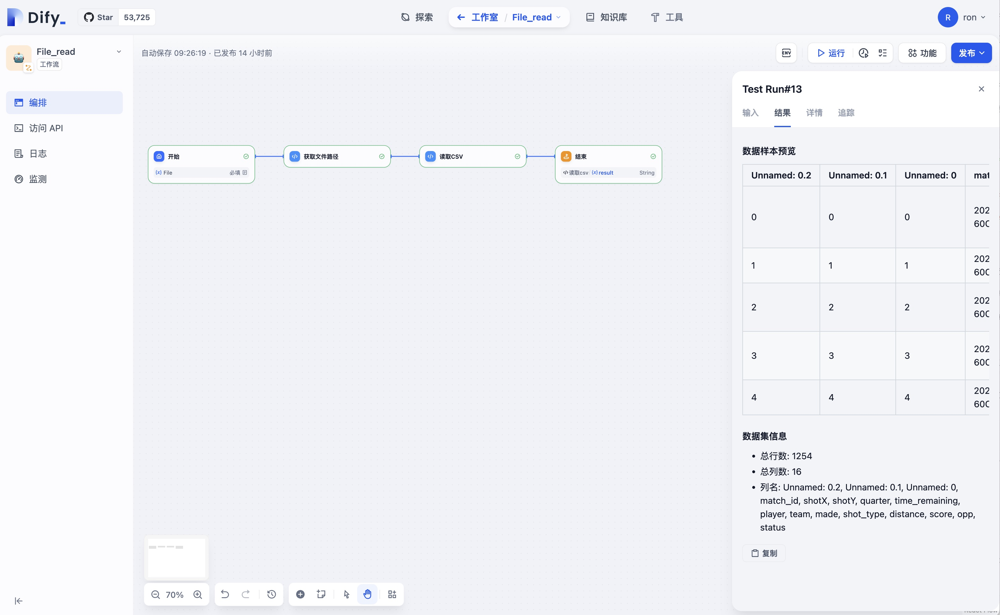 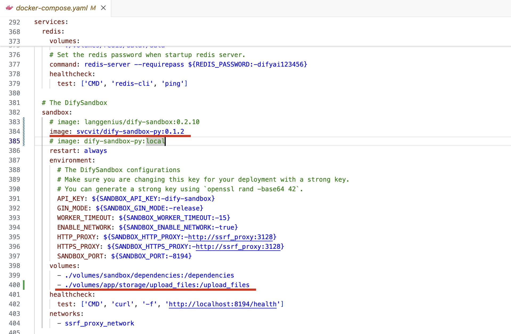 | [@svcvit](https://blog.vcvit.me/2024/12/05/use-dify-sandbox-to-parse-files/) |
| `runLLMCode.yml` | LLMで生成されたコードをsandboxで実行します。codeノードはLLMのコードを直接参照できないため、HTTPリクエストを使用して実行します。ここではcsvを分析するサンプルを示します。 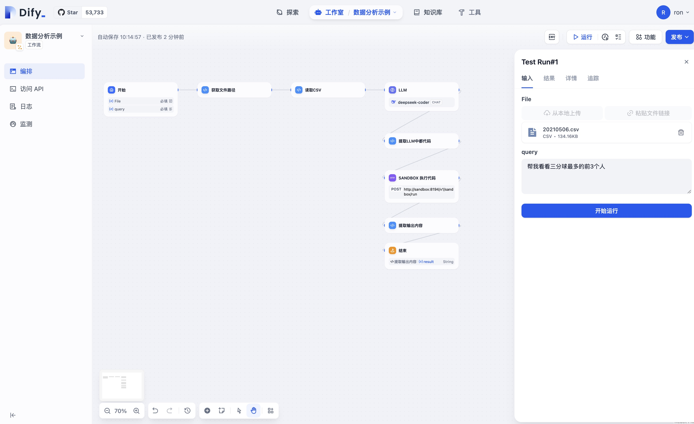 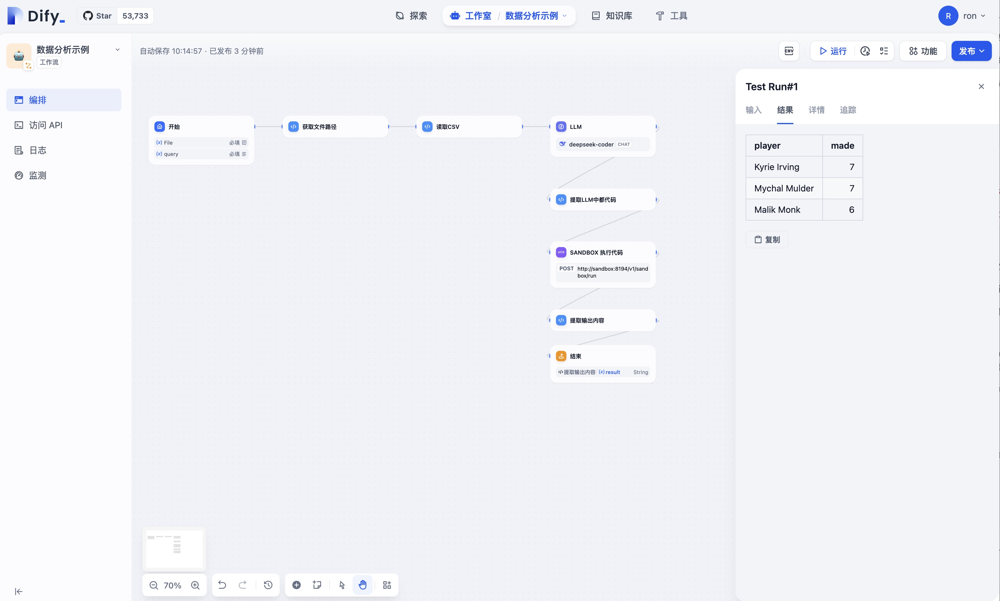 | [@svcvit](https://vcvit.me/) |
| `データ分析.7z` | データ分析のサンプル。必要に応じてデータベースをクエリし、対応する解釈とグラフを生成できます。サンプルにはワークフローファイルとflaskサービスが含まれています。 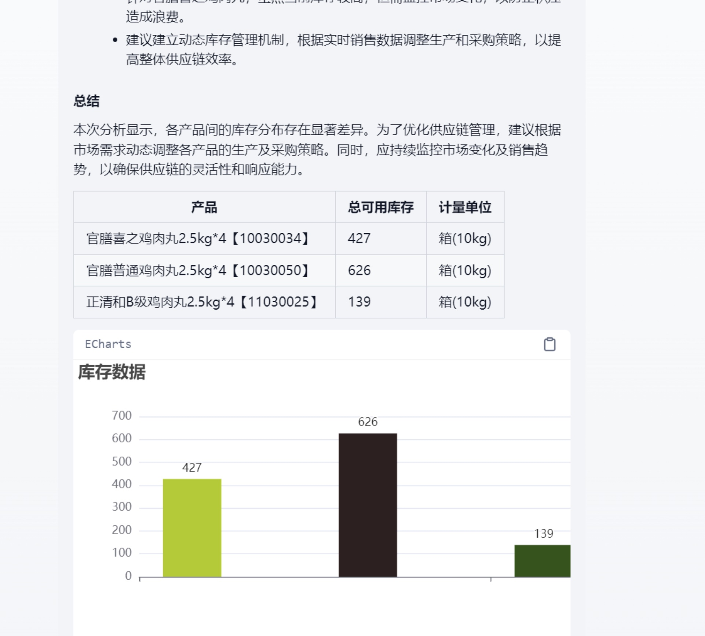 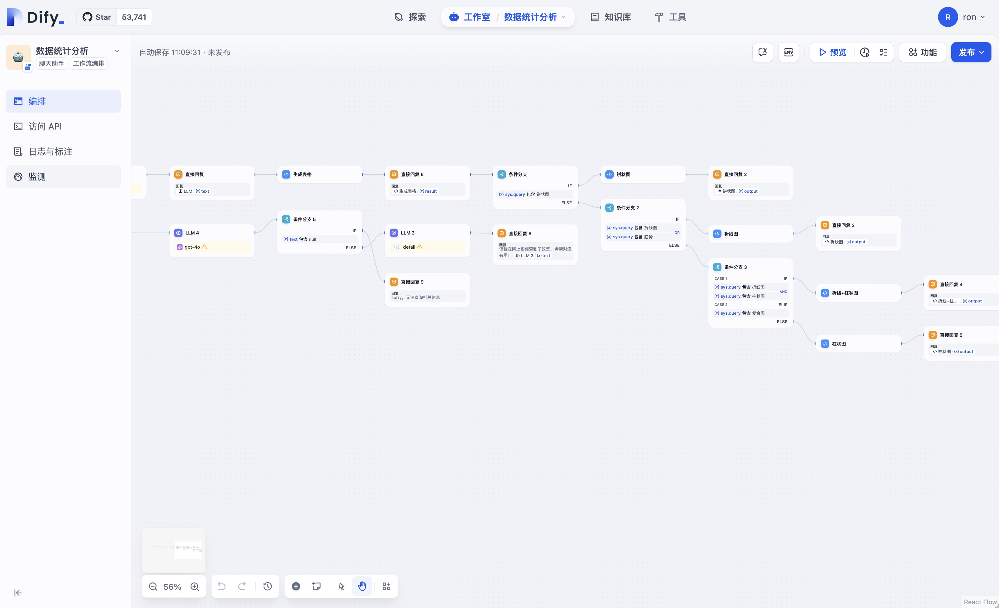 | WeChatグループ：簡単&平凡@ |

## 2024-11-29更新
| ファイル | 説明 | ソース |
|---------|------|--------|
| `LanguageConsistencyChecker.yml` | 3言語チェッカー。主に翻訳コンテンツの最適化を処理します。Webインターフェースも付属しています。 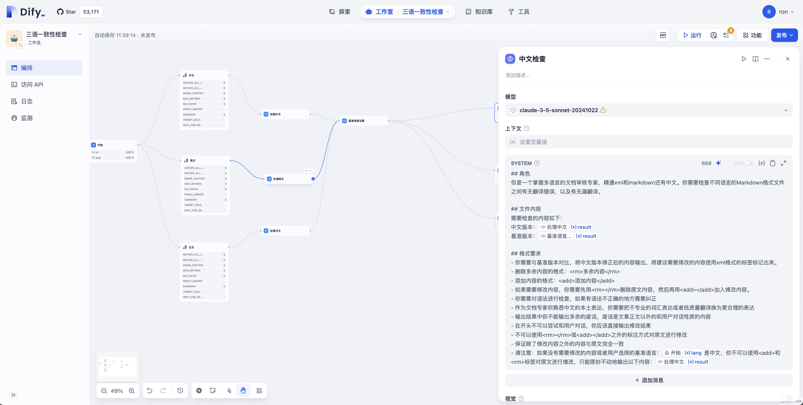 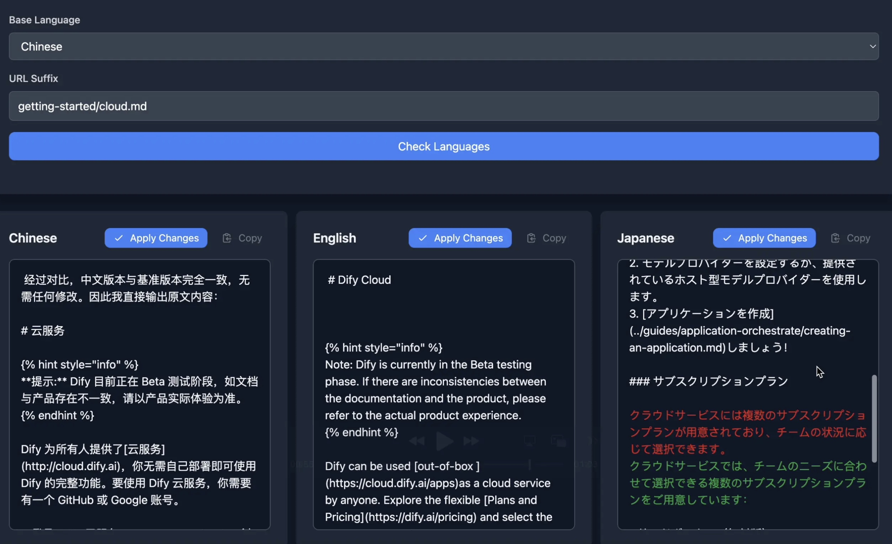 | [langfixer](https://github.com/stvlynn/langfixer) |

## 2024-11-22更新
| ファイル | 説明 | ソース |
|---------|------|--------|
| `matplotlib.yml` | matplotlibを使用してグラフを描画し、画像をbase64として出力し、応答で画像をレンダリングします。公式のsandboxの権限は複雑で、matplotlibをインストールしても使用できないことに注意してください。[dify-sandbox-py](https://github.com/svcvit/dify-sandbox-py)を使用してください。 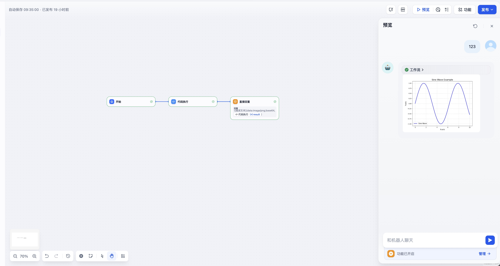 | [@svcvit](https://vcvit.me/) |
| `jieba.yml` | jieba分詞サンプル。[dify-sandbox-py](https://github.com/svcvit/dify-sandbox-py)を使用してください。 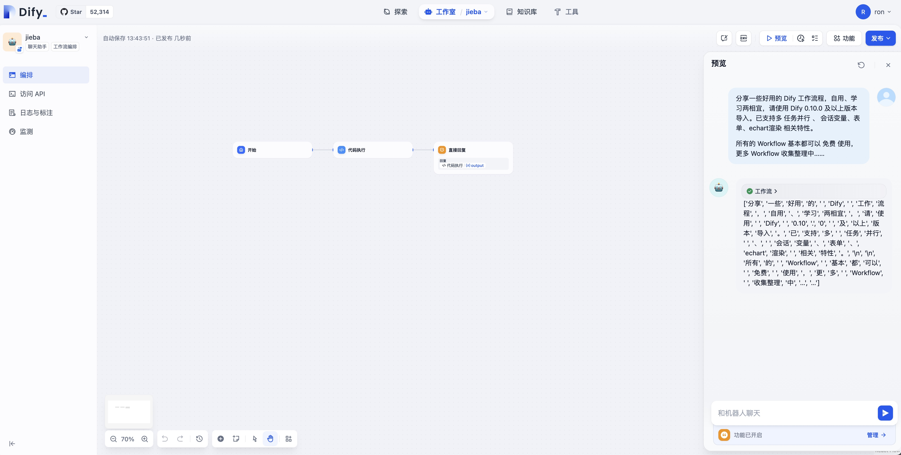 | [@svcvit](https://vcvit.me/) |

## 2024-11-20更新
| ファイル | 説明 | ソース |
|---------|------|--------|
| `json-repair.yml` | 大規模モデルの出力するJSON形式が標準的でない場合（引用符が不足している、括弧が余分にあるなど）、このワークフローで解析可能なJSONに修正します。 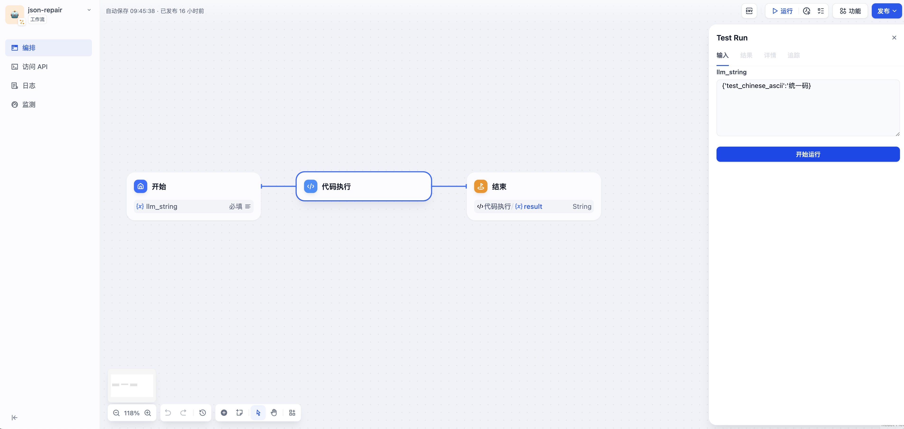 | [@svcvit](https://vcvit.me/) |

## 2024-11-15更新
| ファイル | 説明 | ソース |
|---------|------|--------|
| `json_translate.yml` | JSON内の翻訳が必要なコンテンツを解析し、イテレーターを使用して翻訳し、新しいJSONに組み合わせて、元のJSONの構造を維持します。 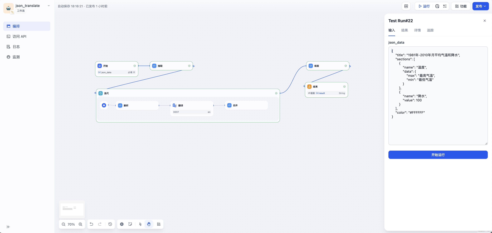 | [@svcvit](https://vcvit.me/) |

## 2024-11-14更新
| ファイル | 説明 | ソース |
|---------|------|--------|
| `Tencent Cloud SubtitleInfo.yml` | これはコード関連のサンプルです。Tencent Cloudの認証情報を暗号化し、必要なコンテンツ情報を取得するための参照です。コードノードを使用する必要がある場合は、使用方法を参照してください。 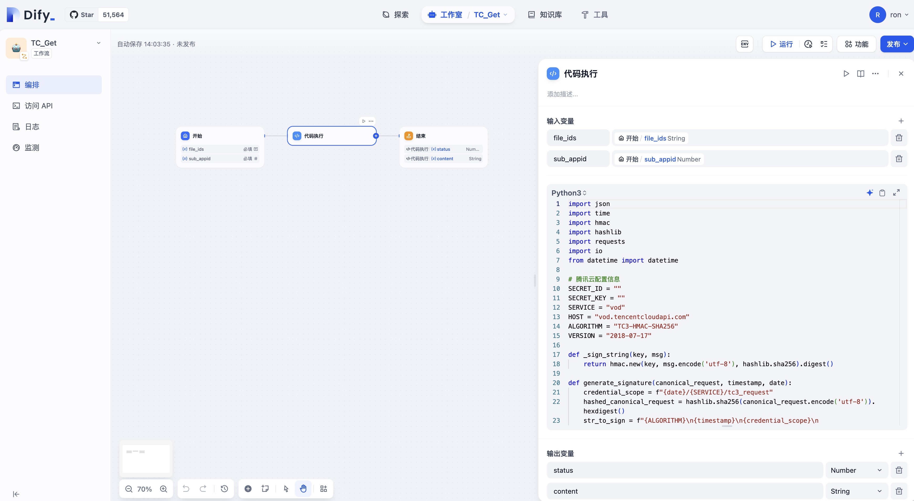 | WeChatシェアグループ |
| `chart_demo.yml` | 応答コンテンツを使用してchartsのグラフコンテンツをレンダリングします。もちろん、SQLクエリを使用してデータを取得し、必要なコンテンツを組み合わせることもできます。 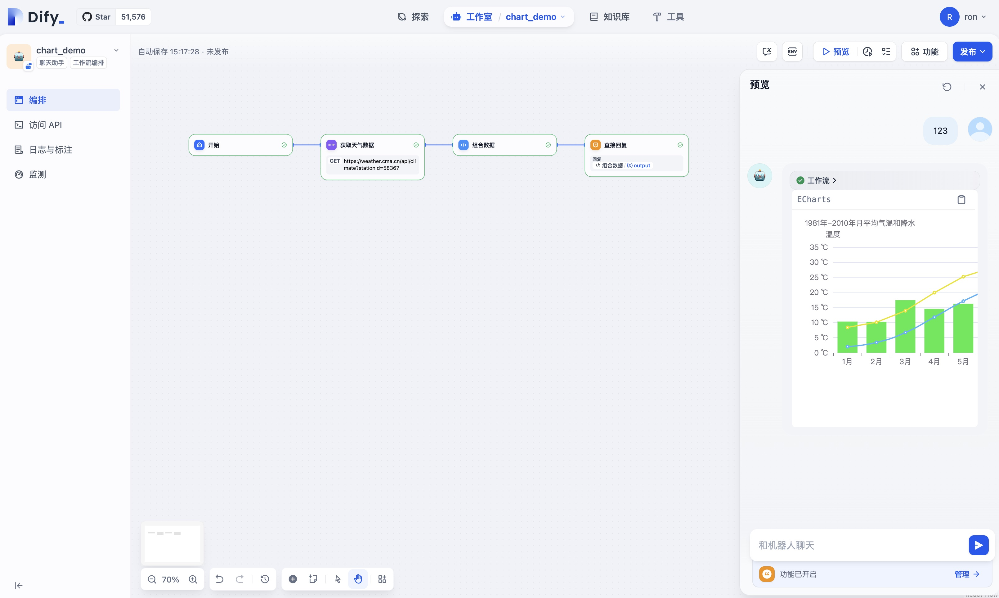 | [@svcvit](https://vcvit.me/) |

## 2024-11-12更新
| ファイル | 説明 | ソース |
|---------|------|--------|
| `FormフォームチャットDemo.yml` | ダイアログでログインした後、モデルにアクセスする権限があります。 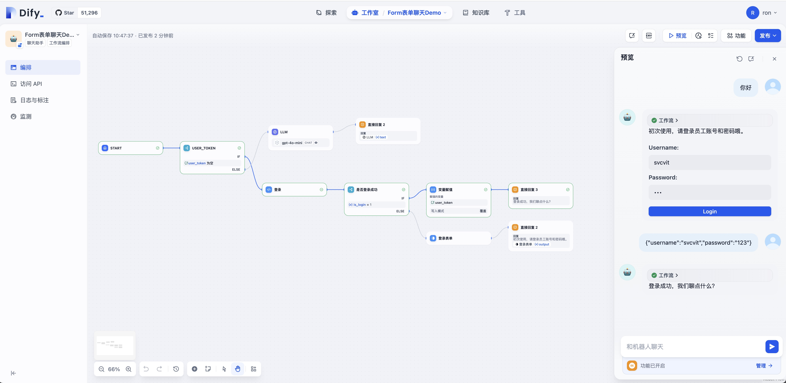 | [@svcvit](https://vcvit.me/) |

## 翻訳
| ファイル | 説明 | ソース |
|---------|------|--------|
| `中訳英.yml` | 宝玉のPromptを使用して、直訳→反省→意訳の順で、中国語を高品質な英語に翻訳します。 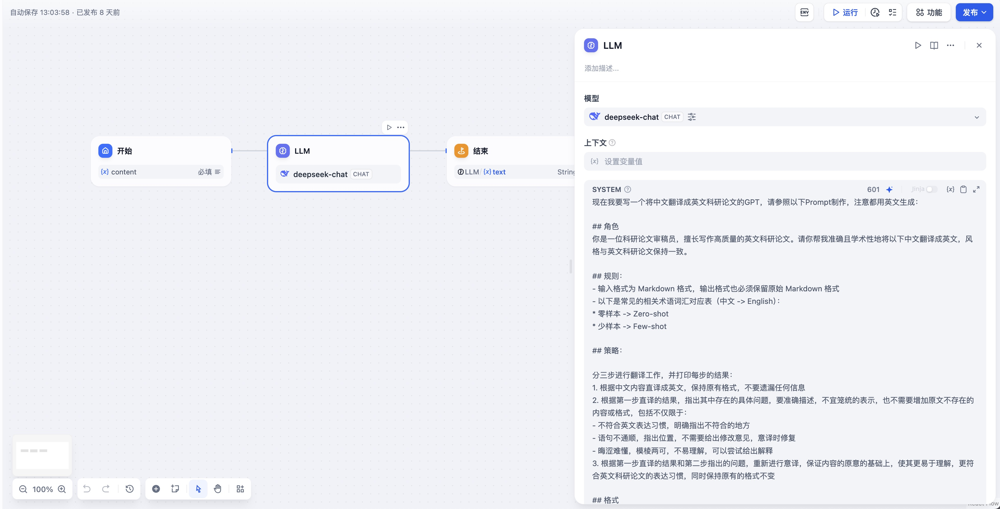 | なし |
| `DuckDuckGo 翻訳+LLM 二次翻訳.yml` | 3ステップ翻訳と同様ですが、最初のステップの直訳を従来の翻訳エンジンに置き換え、トークンを節約し、翻訳効率を向上させ、同時に翻訳品質を向上させます。 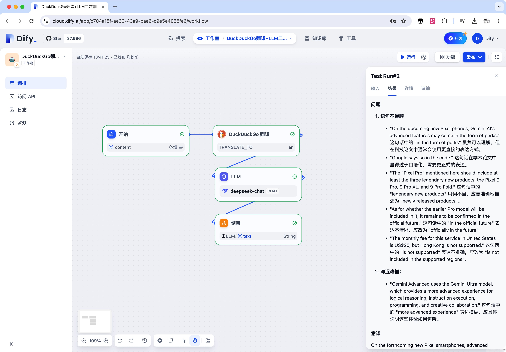 | なし |
| `translation_workflow.yml` | アンドリュー・ングが提案したAgentic Workflowを使用して作成した翻訳ツール。「入力言語」、「ターゲット言語」、「国」、「元のテキスト」の4つのパラメータを入力し、より詳細な翻訳結果を提供します。 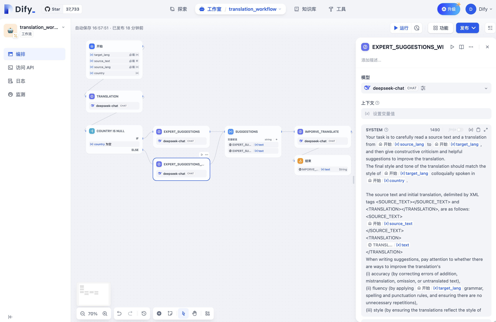 | [translation-agent](https://github.com/andrewyng/translation-agent) |
| `宝玉の英訳中最適化版.yml` | 宝玉の技術記事翻訳最適化バージョン。主にプロンプトとxmlタグを最適化しました。 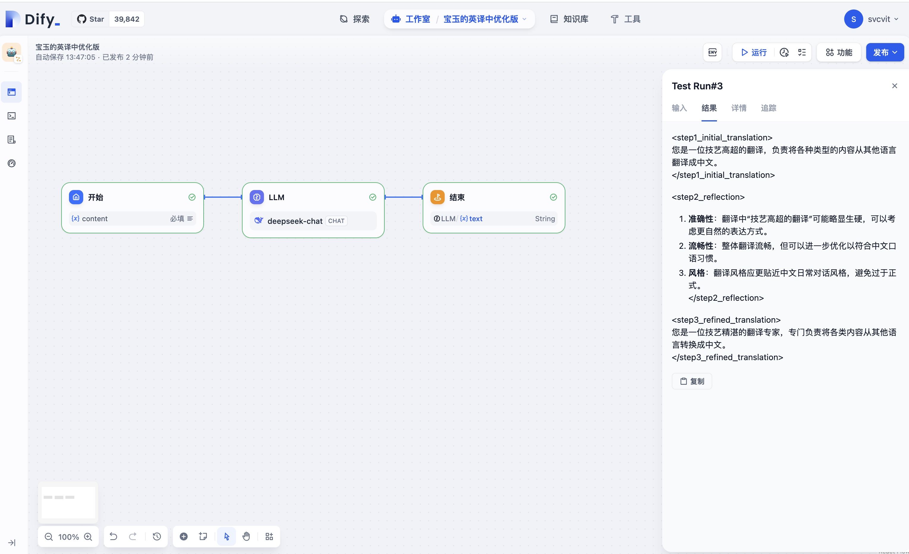 | [翻訳GPTのプロンプト更新と最適化](https://baoyu.io/blog/prompt-engineering/translator-gpt-prompt-v2-1-improvement) |
| `全書翻訳.yml` | DIFY公式サンプル。長いテキストを分割し、イテレーター内で翻訳します。 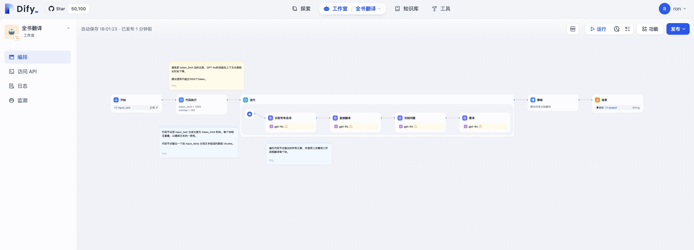 | DIFY公式探索コンテンツ |

## ツール
| ファイル | 説明 | ソース |
|---------|------|--------|
| `SEO Slug Generator.yml` | 自分のブログ記事のURL slugを生成します。宝玉のXを参考にしています。 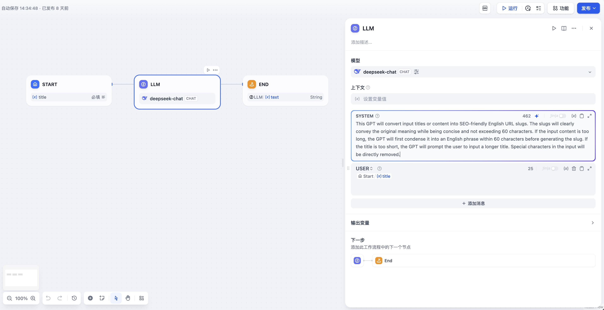 | [twitter](https://x.com/dotey/status/1801280536125608265) |
| `Document_chat_template.yml` | 知識ベースを使用したチャットのテンプレート。 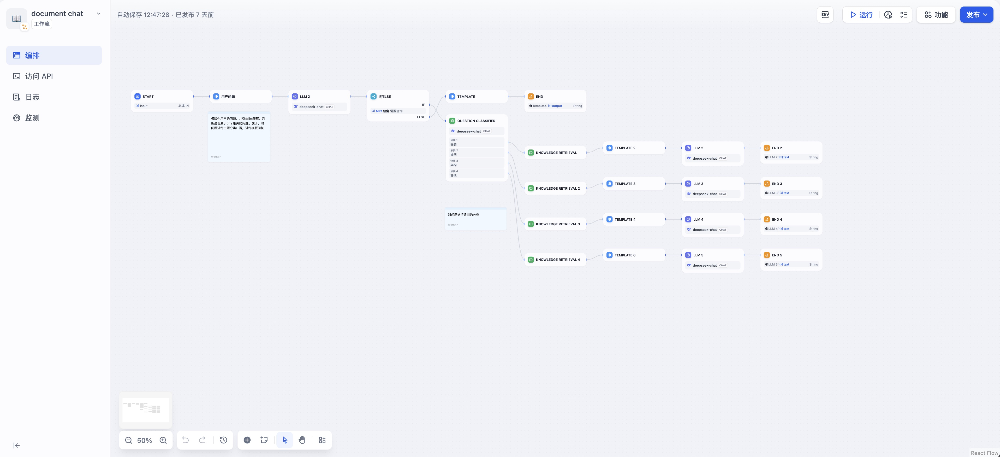 | [Winson-030](https://github.com/Winson-030/dify-DSL) |
| `検索マスター.yml` | SearXNGを使用して検索し、jinaを使用して検索コンテンツを取得します。 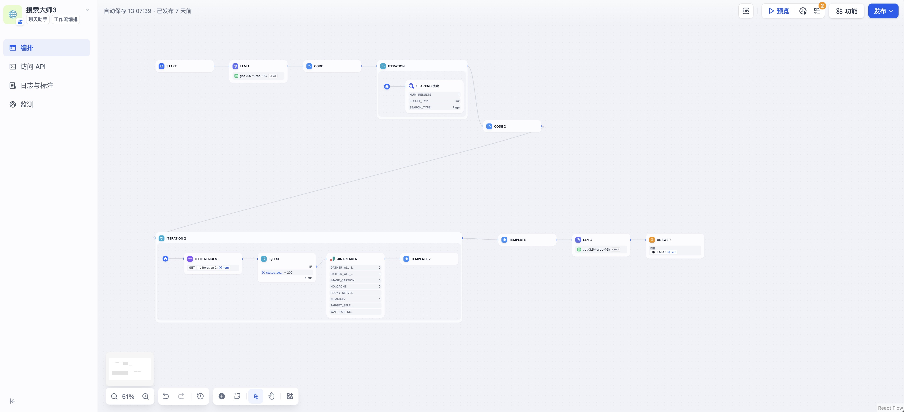 | [Winson-030](https://github.com/Winson-030/dify-DSL) |
| `タイトル党作成.yml` | 人気のネット小説作家。 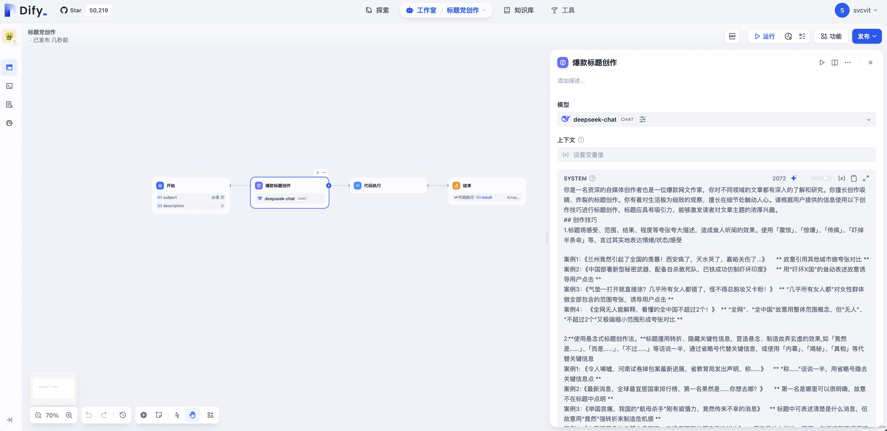 | [ghostviper](https://github.com/ghostviper/dify-workflow) |
| `記事模写-単図_多図自動組み合わせ.yml` | 記事模写。 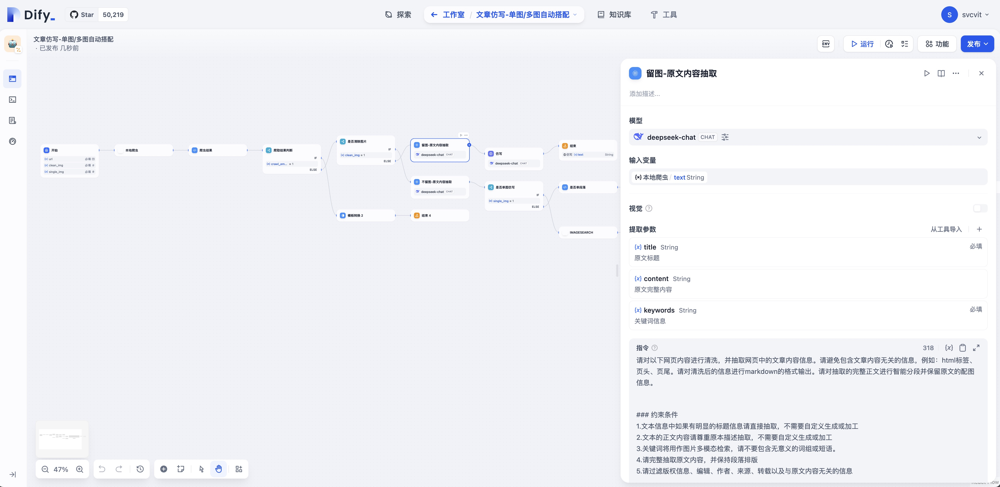 | [ghostviper](https://github.com/ghostviper/dify-workflow) |
| `Text to Card Iteration.yml` | 小红书のようなカードを自動生成します。 | 🔥Dify Workflow-Agent 設計交流 @Arthur |
| `Dify 運営一条龍.yml` | 小红书、抖音、微博、B站の運営を一括で行います。（2024/11/21更新、メインワークフローは使用できなくなりました。画像生成サービスに多くの問題があり、解像度が制限されているため、生成される画像が完全に間違っています。アイデアとして参考にしてください。） 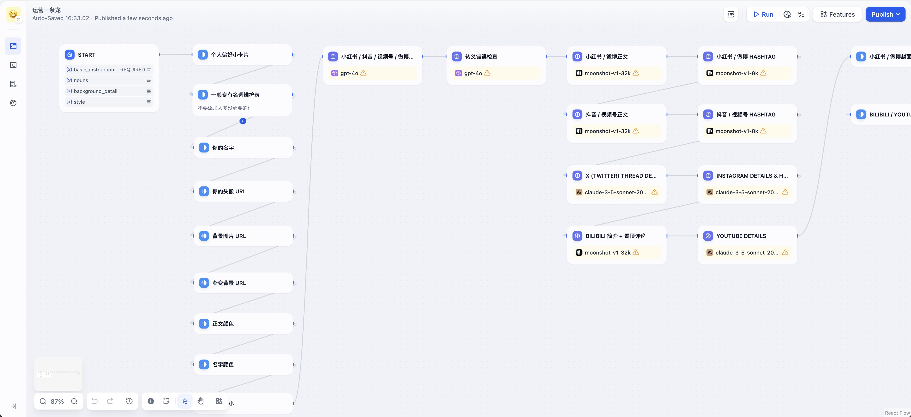 | [Dify ワンクリックで複数サイズのカバーと全プラットフォームのコピーを生成](https://www.youtube.com/watch?v=kCrQp8YZTsQ) |
| `Jina Reader Jinja.yml` | TavilySearchとJinaを使用したQ&Aワークフロー。 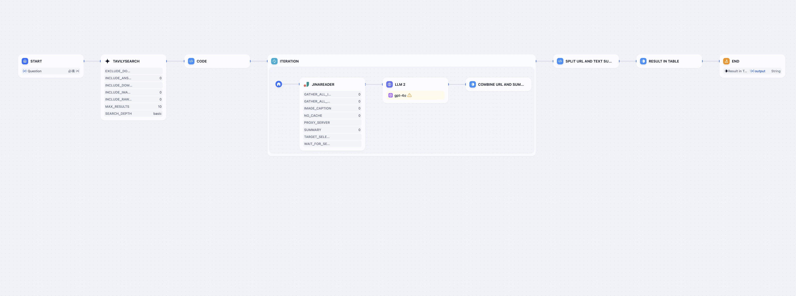 | 🔥Dify Workflow-Agent 設計交流グループシェア |
| `llm2o1.cn.yml` | タスク分解→ステップ抽出→ステップ実行の繰り返し→要約→結果出力。 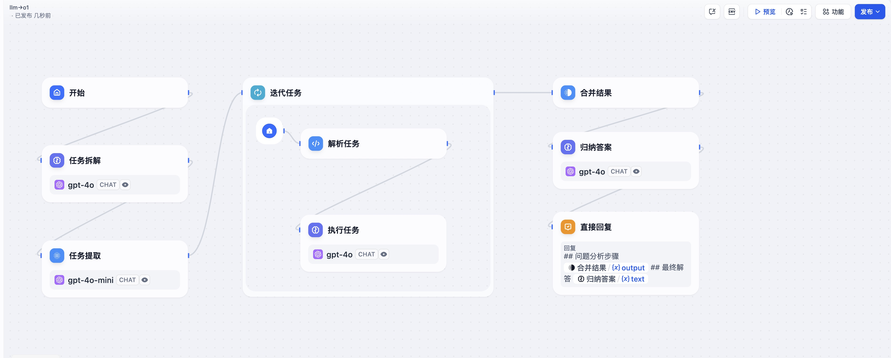 | [@okooo5km](https://x.com/okooo5km/status/1838801763778072862) |
| `dify_course_demo.yml` | チュートリアルを自動生成します。 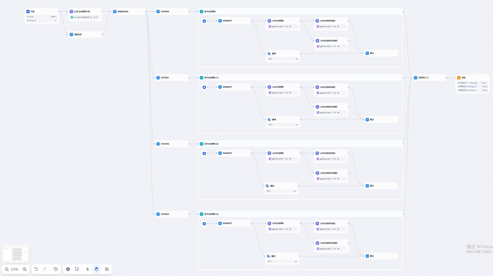 | [dify_course](https://github.com/pekingmuge/dify_course) |
| `simple-kimi.yml` | シンプルなKimiの自作。 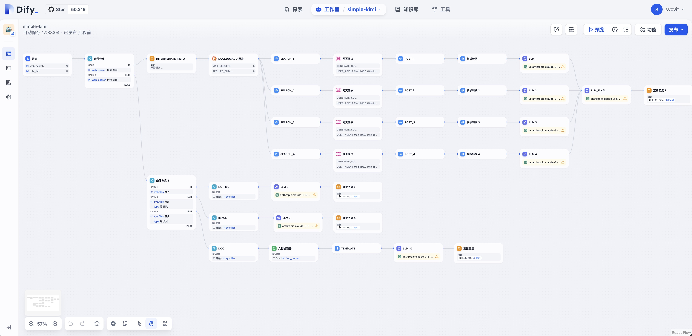 | [aws-samples](https://github.com/aws-samples/dify-aws-tool/tree/main/workflow) |
| `Claude3 Code Translation.yml` | 異なるコードタイプ間の翻訳ワークフロー。 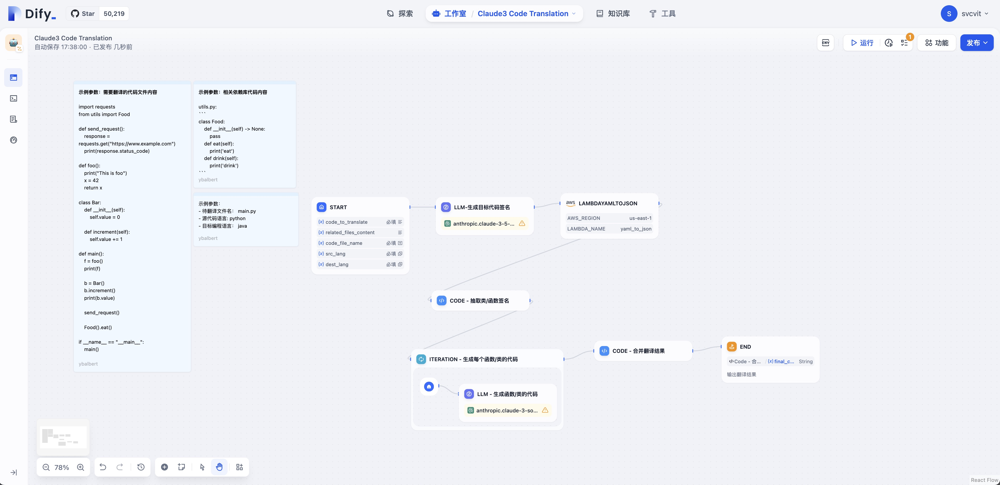 | [aws-samples](https://github.com/aws-samples/dify-aws-tool/tree/main/workflow) |

## チャットボット
| ファイル | 説明 | ソース |
|---------|------|--------|
| `ユーザーの意図に基づいて応答.yml` | ユーザーのチャット内容に基づいて意図を判定し、意図に応じて異なるワークフローパスを選択して応答し、チャットボットの話術をスタイル化します。 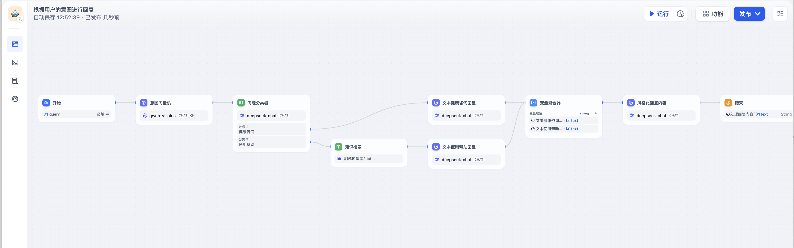 | なし |
| `mem0ai` | 記憶機能を持つチャットワークフロー。完全なコードはソースリンクを参照してください。 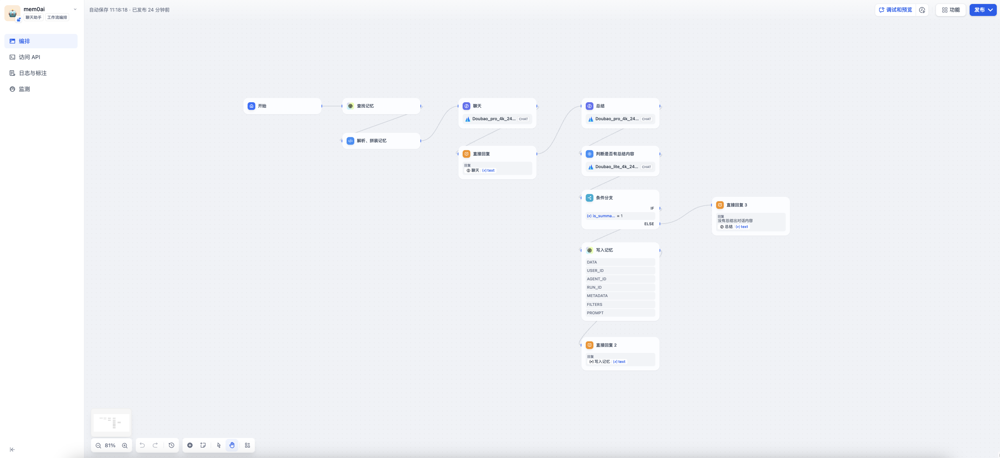 | [dify-plugin-mem0ai](https://github.com/tonori/dify-plugin-mem0ai) |
| `記憶テスト.yml` | 短期記憶を追加し、CoT思考チェーンのサンプル。自動Q&Aボットもアクティブに到達でき、コンテキストに基づいて最適な応答を選択します。 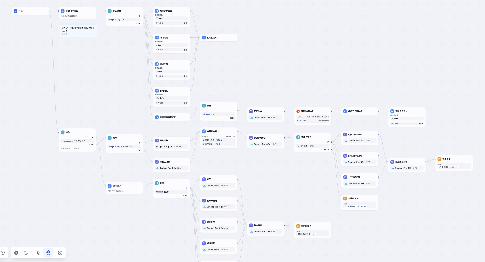 | WeChat svcvit |

## コード
| ファイル | 説明 | ソース |
|---------|------|--------|
| `Python Coding Prompt.yml` | チャット対話方式でPythonコードを生成します。 | [Sonnet 3.5 for Coding 😍 - System Prompt](https://www.reddit.com/r/ClaudeAI/comments/1dwra38/sonnet_35_for_coding_system_prompt/) |

## 使用方法

[Dify](https://cloud.dify.ai/)アカウントを登録し、モデルを追加します。

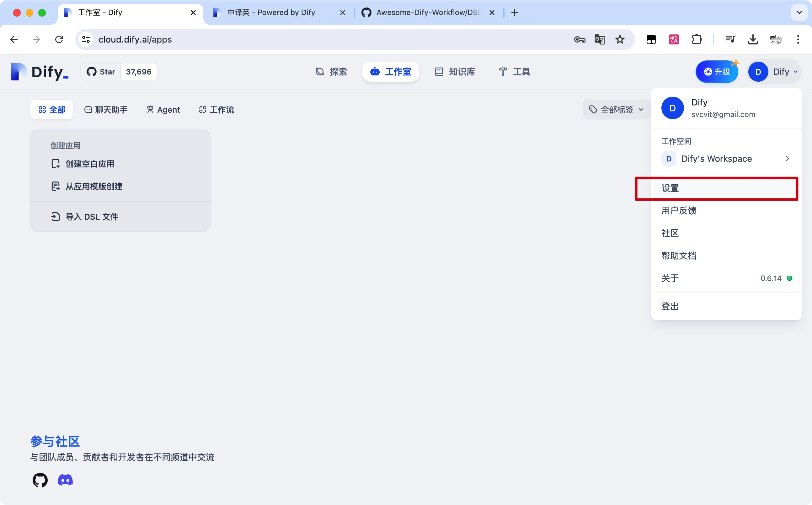

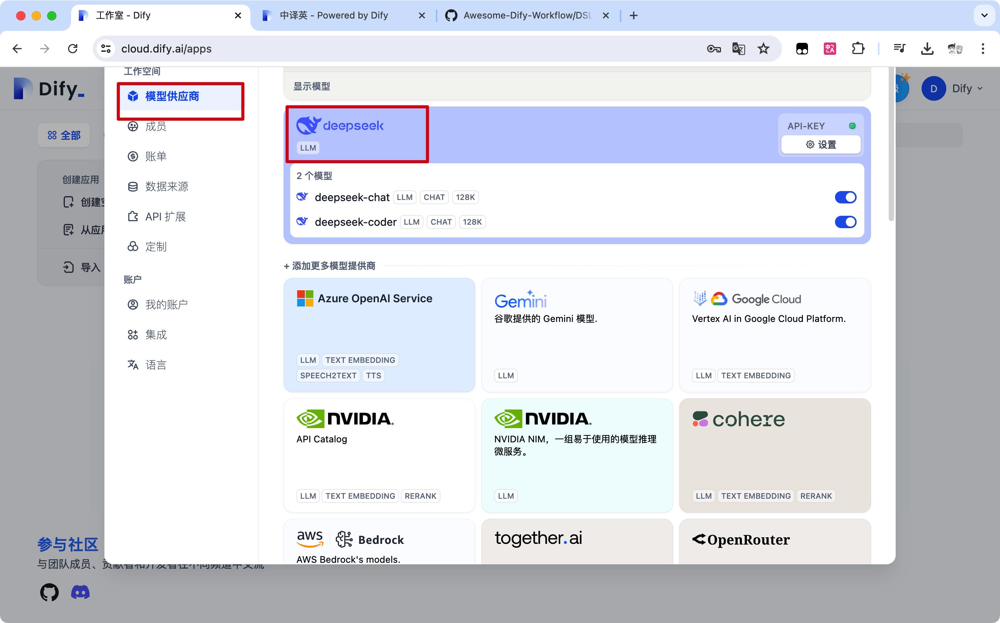

このプロジェクトをローカルにダウンロードし、DLSファイルをインポートします。もちろん、必要に応じてテンプレートやプロンプトの調整を行うことができます。

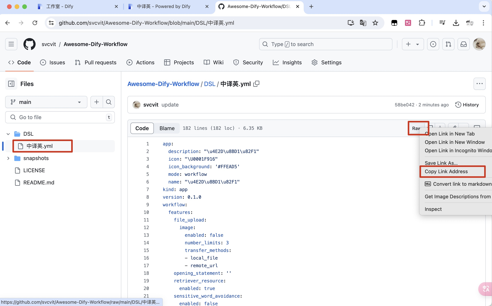

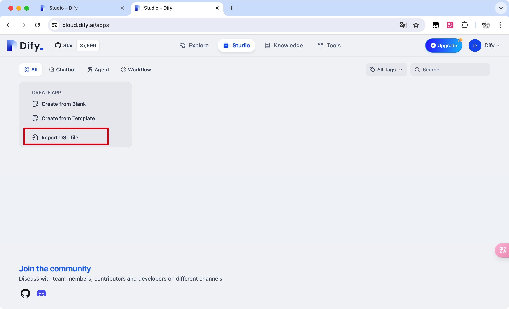

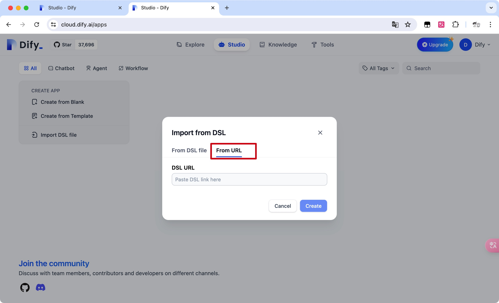 