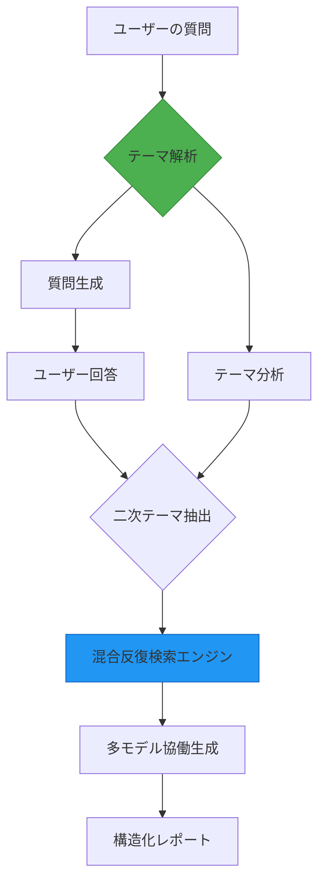

# Deep Researcher ワークフロー再現スキーム

source: https://github.com/AdamPlatin123/Open-Deep-Research-workflow-on-Dify

## 📖 概要
本ワークフローはDifyプラットフォームを基に構築されたDeep Researchの核心機能を再現したもので、ローカル知識ベースとWeb検索を統合した多源検索と多モデル協働を通じて、5分以内に万字級の構造化研究レポートを生成することが可能です。システムはモジュール化設計を採用しており、底層のモデルとデータソースを柔軟に置換できます。

## ✨ 核心機能
- **スマートテーマ解析**  
  Gemini 2.0 Flashモデルを使用した4次元の深層分析をサポートする多層級テーマ分解機能  
- **混合検索エンジン**  
  ローカル知識ベースとウィキペディア/Google/Bing APIの多チャネル検索  
- **動的リズム制御**  
  2>1モデル連携アーキテクチャを採用し、条件分岐と対話回次タグによる処理リズム最適化  
- **効率的なレポート生成**  
  deepseek-r1-distillなどのモデルを統合した段落単位のコンテンツ生成機能で、Markdown形式の構造化出力をサポート  

## 🛠️ 技術アーキテクチャ

## ⚠️ 注意事項
### 性能最適化の提案
ワークフローは原則としてすべてのモデルをサポートしますが、ローカルモデルを使用してリクエスト負荷が高まると、LLMノードで`タイムアウトエラー`が発生する可能性があります。この場合、クラウドAPIサービスに切り替えるか、Difyの設定ファイルでタイムアウト時間を調整することを検討してください。  
Googleの無料APIユーザーの場合は、ローカルモデルノードを挿入してRPM（リクエスト/分）を制限することができます（Googleのデフォルトの制限は15RPMで、短時間に大量のリクエストを送信するとエラーが発生します）。

## To Do List
·処理フローの論理を最適化し、RPMと処理時間のトレードオフを調整する  
·回答に偶発的に複数のサブタイトルが表示される問題を修正する  
·ユーザーの質問の複雑度に適応する問答システムを実装するため、ワークフローの大規模リファクタリングを実施する  

## ライセンス
LGPL3.0ライセンス

